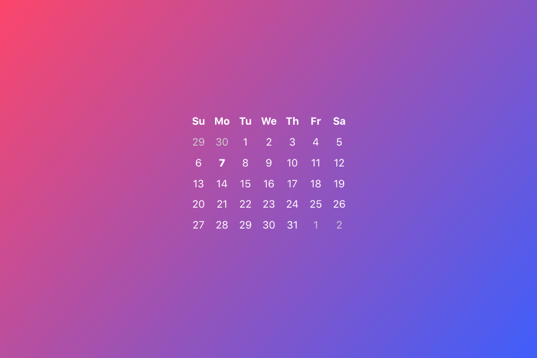

# Calio

[](http://npmjs.com/package/calio)


[](https://travis-ci.org/corneliusio/calio)
[](https://codecov.io/gh/corneliusio/calio)
[](https://github.com/corneliusio/calio/blob/master/LICENSE)

Calio is an un-opinionated date picker built for modern browsers using [Svelte](https://svelte.technology/).  
What does that mean? Zero-dependency, vanilla JS that is lean and ready to use where ever you need a date picker.



---

## Browser support

Out of the box, Calio includes a lean, modern-browser bundle by default and a polyfilled version of the bundle that has browser support reflected in the table below.

```js
import Calio from 'calio';
// or 
import Calio from 'calio/polyfilled';
```

| IE\*  | Chrome | Edge | Firefox | Safari / iOS | UC Android | Samsung |
| ----- | ------ | ---- | ------- | ------------ | ---------- | ------- |
| 11    | 60+    | 15+  | 53+     | 10+          | 11+        | 6+      |

**\***[IE11 support](extra/IE.md) requires the inclusion of additional CSS.

---

## Demo

[corneliusio.github.io/calio](https://corneliusio.github.io/calio/)

## Usage

```shell
npm install calio --save
```

```js
import Calio from 'calio';
```

or manually include `dist/calio.polyfilled.min.js` in your HTML:

```html
<script src="https://unpkg.com/calio"></script>
```

Then, instantiate your date picker!

```js
new Calio('#calio');
```

---

## Examples

You may notice at this point that this really is **just a date picker**. Where's the navigation? What about the currently month being viewed? These are not imposed on you out of the box, but can easily be added in *whatever way works best for your design*. Here are a couple striped down examples of how you may integrate Calio into your project, more API details can be found further below.

### Navigation
```html
<button class="prev">Prev</button>
<button class="today">Today</button>
<button class="next">Next</button>

<div id="calio"></div>

<script src="https://unpkg.com/calio"></script>
<script>
    const calio = new Calio('#calio');

    document.querySelector('.today').addEventListener('click', event => calio.goToThisMonth());
    document.querySelector('.prev').addEventListener('click', event => calio.goToLastMonth());
    document.querySelector('.next').addEventListener('click', event => calio.goToNextMonth());
</script>
```

That wasn't too bad, was it!

### Current
Displaying things like the current selection or view is pretty easy too.

```html
<h4 class="viewing"></h4>
<div id="calio"></div>
<h5 class="selected"></h5>

<script src="https://unpkg.com/calio"></script>
<script>
    const calio = new Calio('#calio');
    const viewing = document.querySelector('.viewing');
    const selected = document.querySelector('.selected');

    calio.$on('view', ({ detail: view }) => {
        viewing.textContent = view.format('mmmm yyyy');
    });

    calio.$on('selection', ({ detail: selection }) => {
        selected.textContent = selection.format('mediumDate');
    });
</script>
```

---

## Options

### Defaults:

```js
new Calio(el, {
    headers: ['Su', 'Mo', 'Tu', 'We', 'Th', 'Fr', 'Sa'],
    mode: 'single',
    strict: false,
    disabled: [],
    value: null,
    limit: null,
    min: null,
    max: null    
});
```

### headers
An array of values you would like to use as the days of the week. You can also disable headers all together by passing `false`.

```js
new Calio(el, {
    headers: ['S', 'M', 'T', 'W', 'T', 'F', 'S']   
});
```

### mode *`single|multi|range`*
`single` - *(default)* acts as a basic date picker, the user picks a single date at any given time.  
`multi` - allows the user select multiple dates at once.  
`range` - allows the user to select only two dates at a time&mdash;highlighting all dates between their selections.

```js
new Calio(el, {
    mode: 'range'
});
```

### value
An initial value for the date picker. This can be:  
- a Javascript [Date](https://developer.mozilla.org/en-US/docs/Web/JavaScript/Reference/Global_Objects/Date) object  
- a string or number accepted by Javascript's [Date](https://developer.mozilla.org/en-US/docs/Web/JavaScript/Reference/Global_Objects/Date) object  
- or a returned date item (such as a selection) from another instance of Calio.

```js
new Calio(el, {
    value: '1988-11-25'
});
```

In the case of `multi` or `range` mode, this should be an array of any of the above types.

```js
new Calio(el, {
    mode: 'range',
    value: [
        new Date(2018, 5, 1),
        '2018-06-03'
    ]
});
```

If you need to pass the year, month, and day to the underling `Date` object as individual arguments for any of the modes pass them as an array of arrays. **e.g.** `[[2018, 0, 1]]`

```js
new Calio(el, {
    mode: 'multi',
    value: [
        [2018, 5, 1],
        [2018, 5, 2],
        [2018, 5, 3]
    ]
});
```

### limit
##### *Only applies to mode: 'multi'*  
The number of selections that can be made in `multi` mode. Has no effect in `single` or `range` modes.

```js
new Calio(el, {
    mode: 'multi',
    limit: 3
});
```

### disabled
A date or array of dates that cannot be selected.

```js
new Calio(el, {
    disabled: new Date()
});
```

### strict
##### *Only applies to mode: 'range' with a disabled date or dates*  
Whether to allow a date range to pass through a disabled date. If `true` a user will not be able to select a second date if a disabled date falls within the created range.

```js
new Calio(el, {
    mode: 'range',
    strict: true,
    disabled: [
        new Date(2018, 5, 1),
        new Date(2018, 5, 3)
    ]
});
```

### min
A minimum date that can be selected. Can accept any type that `value` does. Any date on the datepicker before the provided minimum will not be selectable.

```js
new Calio(el, {
    min: new Date()
});
```

### max
A maximum date that can be selected. Can accept any type that `value` does. Any date on the datepicker after the provided maximum will not be selectable.

```js
new Calio(el, {
    max: new Date()
});
```

---

## Events

### view
This event fires whenever the currently displayed month is updated and is passed an instance of the 1st of the displayed month.

```js
const calio = new Calio(el);

calio.$on('view', event => {
    const { view } = event.detail;
    // Do something with the value of "view"
});
// or
el.addEventListener('calio:view', event => {
    const { view } = event.detail;
    
    // Do something with the value of "view"
});
```

### selection
This event fires whenever the user selects a new date and is passed the full selection of the current Calio instance.

```js
const calio = new Calio(el);

calio.$on('selection', event => {
    // Do something with the value of "event.detail"
    // Note that in the case of range and multi modes, "selection" includes all dates currently selected.
});
// or
el.addEventListener('calio:selection', event => {
    // Do something with the value of "event.detail"
});
```

---

## API

### select(day)
Problematically make a selection.

```js
const calio = new Calio(el);

if (someCondition) {
    calio.select('2018-01-04');
}
```

### makeMyDay(day)
Normalizes any selection value object, `Date` object, or `Date` parsable string/integer into the object Calio uses for dates.

```js
const calio = new Calio(el);
const { selection } = calio.get();
const today = calio.makeMyDay(Date.now());

if (selection.isBefore(today)) {
    // Do something if the selection is before today.
}
```

### goToYear(y)
Jump to the (full 4-digit) year provided.

```js
const calio = new Calio(el);

calio.goToYear(1988);
```

### goToNextYear()
Jump to the next year.

```js
const calio = new Calio(el);

calio.goToNextYear();
```

### goToLastYear()
Jump to the previous year.

```js
const calio = new Calio(el);

calio.goToLastYear();
```

### goToMonth(m)
Jump to the month provided. Works with a conventional 1-12 index (i.e. 1: Jan, 2: Feb, etc…) as opposed to the [0 based index](https://developer.mozilla.org/en-US/docs/Web/JavaScript/Reference/Global_Objects/Date#Parameters) that Javascript's Date object uses for months.

```js
const calio = new Calio(el);

calio.goToMonth(12);
```

### goToNextMonth()
Jump to the next month.

```js
const calio = new Calio(el);

calio.goToNextMonth();
```

### goToLastMonth()
Jump to the previous month.

```js
const calio = new Calio(el);

calio.goToLastMonth();
```

### goToThisMonth()
Jump to this month (i.e. jump to today).

```js
const calio = new Calio(el);

calio.goToThisMonth();
```

### goToSelection()
##### *Only works in mode: 'single'*  
Jump to the currently selected date when in the default 'single' mode.  
For 'multi' or 'range' mode, see `goTo(day)` below.

```js
const calio = new Calio(el);

calio.goToSelection();
```

### goTo(day)
Jump directly to any passed selection value object, `Date` object, or `Date` parsable string/integer.

```js
const calio = new Calio(el, {
    mode: 'multi',
    value: [
        '2018-02-05',
        '2018-06-12',
        '2018-07-24'
    ]
});
const { selection } = calio.get();

calio.goTo(selection[2]); // Will jump to July.
```

## Styling

```css
#calio {
    --size;             // size of single grid item (both horizontal and vertical)
    --size-x;           // horizontal size of single grid item
    --size-y;           // vertical size of single grid item
    --color;            // date text color
    --color-hover;      // date text color on hover
    --bg-hover;         // date background color on hover
    --color-inactive;   // text color for visible dates from prev/next month
    --bg-inactive;      // background color for visible dates from prev/next month
    --color-disabled;   // text color for dates disabled by min, max, disabled values
    --bg-disabled;      // background color for dates disabled by min, max, disabled values
    --opacity-disabled; // opacity for dates disabled by min, max, disabled values
    --color-ranged;     // text color for dates between two selections in range mode
    --bg-ranged;        // background color for dates between two selections in range mode
    --color-active;     // text color for a selected date
    --bg-active;        // background color for a selected date
}
```

[MIT License](LICENSE). &copy; 2017 [Cornelius Ukena](https://cornelius.io).
